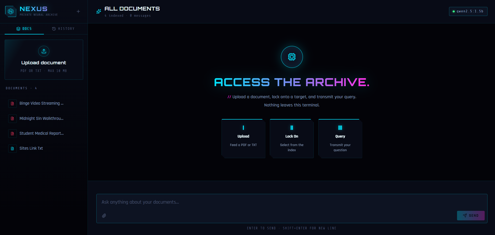

<p align="center">
  
</p>

<h1 align="center">Nexus</h1>

<p align="center">A fully local document chat application. Upload PDFs or text files and ask questions about them, powered by RAG (Retrieval-Augmented Generation) with local AI models via Ollama. No API keys, no cloud, no data leaves your machine.</p>

<p align="center">
  
  
  
  
  
</p>

<p align="center"></p>

## Design

A neon terminal / data archive: void-black background with a drifting circuit grid and cyan and magenta glow, Orbitron display type over a Rajdhani body face, a hexagonal glitching logo mark, gradient neon scrollbars and hover glows throughout, and an angular sci-fi sidebar drawer that collapses into a hamburger menu on mobile.

## Features

- **Local-First**: all processing runs via Ollama; your documents never leave your machine
- **PDF & TXT Support**: upload and parse documents up to 10 MB
- **Semantic Search**: documents are chunked, embedded, and stored in LanceDB for vector similarity search
- **Streaming Responses**: answers stream token-by-token via Server-Sent Events
- **Source Citations**: every answer shows the retrieved chunks and their source locations
- **Document Summarization**: generate a full summary of any uploaded document
- **Document Management**: upload, select, and delete documents from the sidebar
- **Chat History**: conversations are persisted in browser localStorage, with a one-click clear
- **Responsive Layout**: full mobile support with a collapsible sidebar drawer
- **Markdown Rendering**: responses render with full Markdown and code highlighting

## Tech Stack

### Backend
| Layer | Technology |
|---|---|
| API | FastAPI + Uvicorn |
| LLM Runtime | Ollama |
| Language Model | `qwen2.5:1.5b` (986 MB) |
| Embeddings | `nomic-embed-text` (274 MB) |
| Vector Store | LanceDB |
| PDF Parsing | pdfplumber |
| HTTP Client | httpx |

### Frontend
| Layer | Technology |
|---|---|
| Framework | React 19 + Vite |
| Language | TypeScript |
| File Upload | react-dropzone |
| Markdown | react-markdown + react-syntax-highlighter |
| Icons | lucide-react |

## Getting Started

### Prerequisites

- [Ollama](https://ollama.com): local AI runtime
- Python 3.10+
- Node.js 18+

### 1. Install Ollama Models

```bash
ollama pull qwen2.5:1.5b
ollama pull nomic-embed-text
```

### 2. Backend Setup

```bash
cd backend
python -m venv venv

# Windows
venv\Scripts\activate
# macOS / Linux
source venv/bin/activate

pip install -r requirements.txt
uvicorn main:app --reload
```

The API will be available at `http://localhost:8000`.

### 3. Frontend Setup

```bash
cd frontend
npm install
npm run dev
```

Open [http://localhost:5173](http://localhost:5173).

## How It Works

1. **Upload** a PDF or TXT file via drag-and-drop
2. The backend **chunks** the document and generates **vector embeddings** using `nomic-embed-text`
3. Embeddings are stored in **LanceDB** (a local vector database)
4. When you ask a question, the backend performs a **semantic search**, prefiltered to your selected document(s), to retrieve the most relevant chunks
5. The retrieved chunks are injected into the prompt and sent to **qwen2.5:1.5b** via Ollama
6. The response **streams** back to the frontend token-by-token

## Project Structure

```
├── backend/
│   ├── main.py           # FastAPI app: all API routes
│   ├── embedder.py       # Text to vector embeddings via Ollama
│   ├── vectorstore.py    # LanceDB wrapper (store & search)
│   ├── ingestor.py       # PDF/TXT to chunks to embed to store pipeline
│   └── requirements.txt
└── frontend/
    └── src/
        ├── App.tsx        # Main React component
        ├── api.ts         # Backend API calls
        └── chatStorage.ts # Chat history (localStorage)
```

## License

MIT
